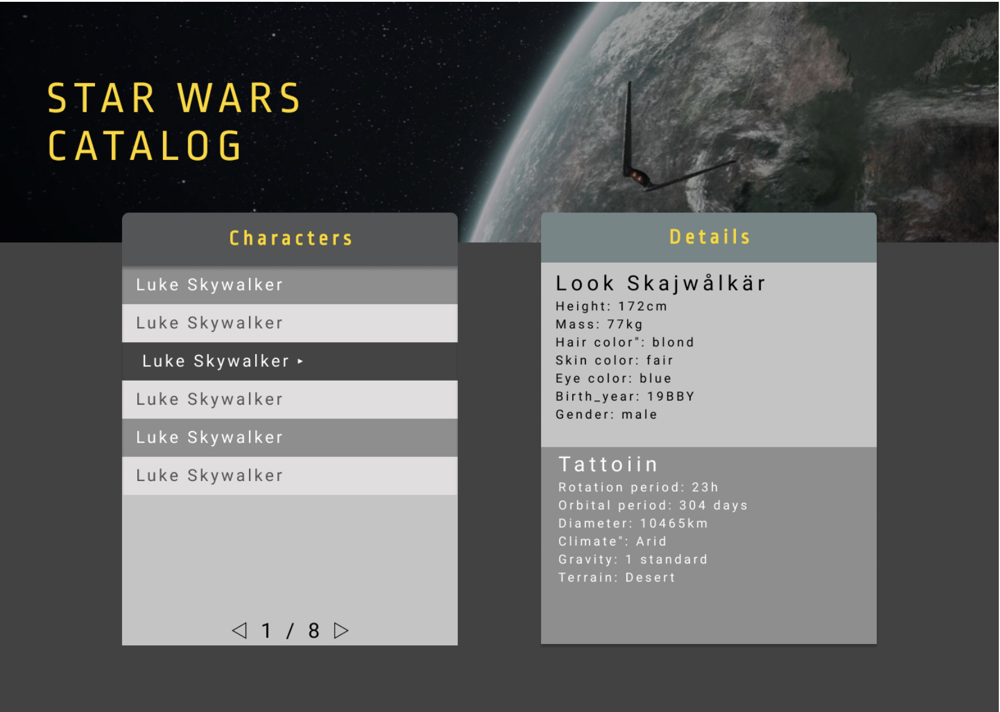

# May the API be with you
tekniker: mounted(), fetch()

## Uppvärmning
1. Börja med att bekanta dig med API:et. Du hämtar samtliga kategorier från länken https://swapi.dev/api/.
2. Prova på att skapa en fetch för länken ovan, vad blir resultatet om du lägger ut det i konsol loggen? Se hur du "hämtar" från länken nedanför.
```js
function fetchCategories() {
  const response = await fetch("https://swapi.dev/api/");
  const data = await response.json();

  console.log(data);
}
```
  1. Ändra scriptet så att den endast skriver ut länken för "people" i konsolen.

## Vidarutveckling: steg för steg
Design att dra inspiration från. Använd följande design för att skapa dina komponenter
 i lösningen.

1. Hämta ett objekt ( person, planet, fordon ) från Star Wars API:et och presentera snyggt i komponentens view. Datan ska hämtas i mounted() hooken. "Ett" lösningsförslag, https://repl.it/@JohanKivi/May-the-API-be-with-you

2. Prova att hämta särskila planeter eller figurer med de olika kategorilänkarna i resultatet från ovan. Exempelvis så hämtar "https://swapi.dev/api/films/2" filmen "The Empire Strikes back". Hela responsen nedanför.
```json
{
	"title": "The Empire Strikes Back",
	"episode_id": 5,
	"opening_crawl": "It is a dark time for the\r\nRebellion. ...  far reaches of space....",
	"director": "Irvin Kershner",
	"producer": "Gary Kurtz, Rick McCallum",
	"release_date": "1980-05-17",
	"characters": [
		"https://swapi.dev/api/people/1/",
    ...
		"https://swapi.dev/api/people/26/"
	],
	"planets": [
		"https://swapi.dev/api/planets/4/",
    ...
		"https://swapi.dev/api/planets/27/"
	],
	"starships": [
		"https://swapi.dev/api/starships/3/",
    ...
		"https://swapi.dev/api/starships/23/"
	],
	"vehicles": [
		"https://swapi.dev/api/vehicles/8/",
    ...
		"https://swapi.dev/api/vehicles/20/"
	],
	"species": [
		"https://swapi.dev/api/species/1/",
    ...
		"https://swapi.dev/api/species/7/"
	],
	"created": "2014-12-12T11:26:24.656000Z",
	"edited": "2014-12-15T13:07:53.386000Z",
	"url": "https://swapi.dev/api/films/2/"
}
```
3. Implementera sedan designen ovan för en särskild människa i starwars universe. Exempelvis som i bildan ovanför.

## Utmaningar
1. Lägg sedan till så att användaren kan "bläddra" mellan människor i starwars.
2. Gör så att användaren kan söka mellan fritt i swapi apiet, se https://swapi.dev/documentation#search för hintar om hur du går tillväga.


