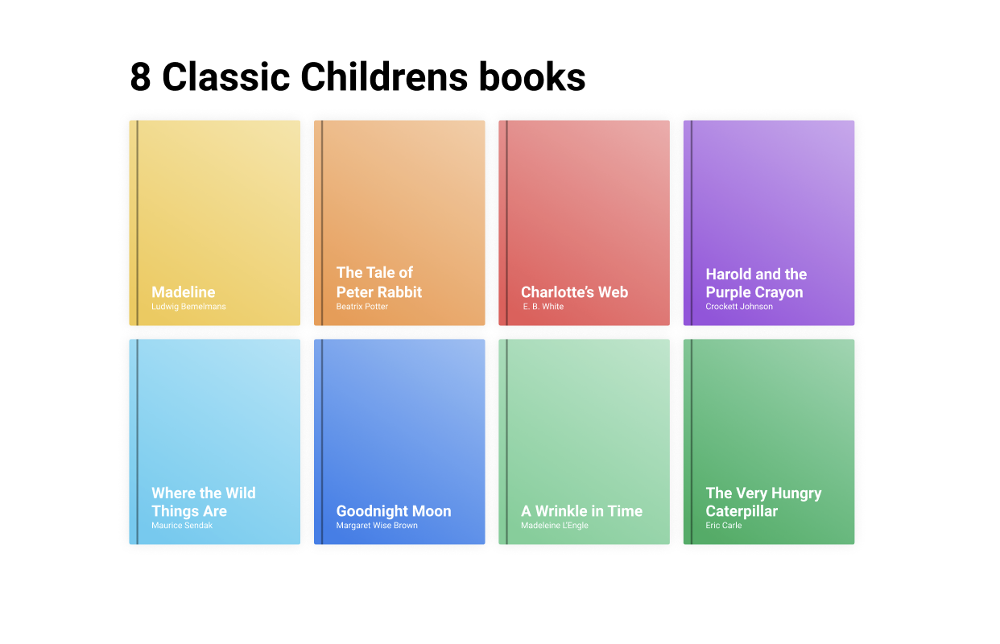
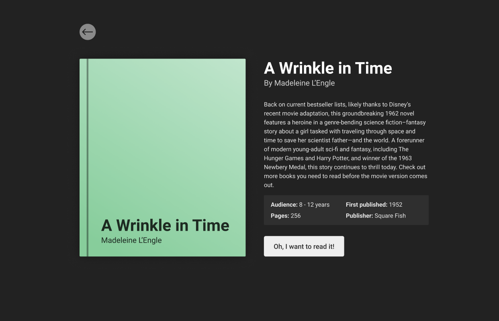
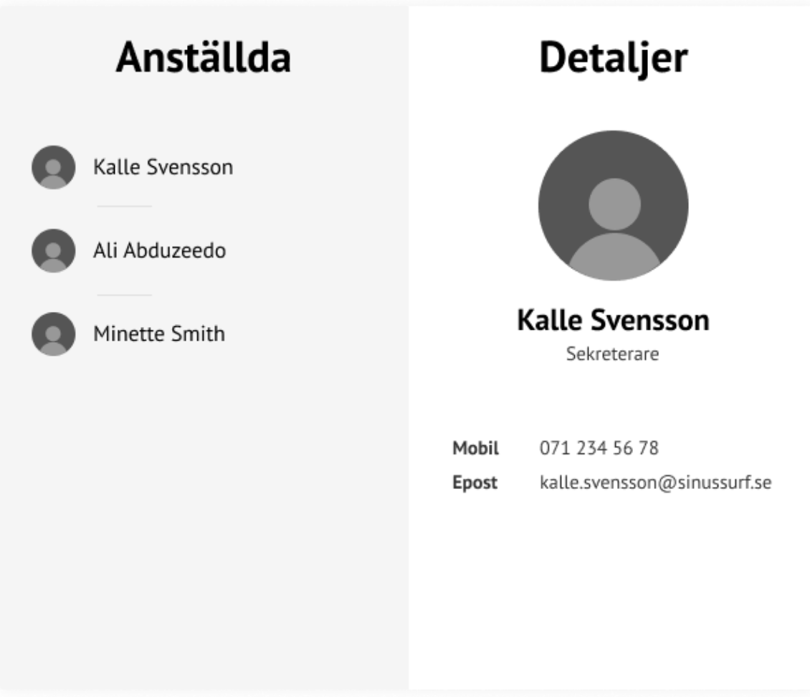

# Router

## Workshop: Pages
Gör en enkel layout bestående av Header, och en router-view med 3st undersidor ( views ). Headern ska innehålla nav ( router-links ).
* Home
* About
* Blog

## Workshop: Mini Library Childrens books
JK kodar: https://github.com/johankivi/mini-library
Json data: https://github.com/johankivi/mini-library/blob/master/src/assets/childrensbooks.json

### Steg 1
Klicka på en bok. Få upp mer info om boken i en ny view som overlay togglas med v-show / v-if. 

### Steg 2
Klicka på en bok. Få upp mer info om boken i en ny view med dynamic route.
Hämta rätt bok i BookInfo.vue med hjälp av router.params. 

Ex. #/books/:id

/books	
				          

/books/:id 

## Workshop: Nested Routes - Staff List

### Steg 1
Gör en sida med två olika routes som visar en varsin view ( home, staff ).
Staff Vyn ska se ut ungefär enligt bilden Nedanför. Klicka på ett namn och visa mer info i en child component. Obs, använd v-show.

route: /staff

### Steg 2
Ersätt info-child-componenten med en nested route som visar informationen istället.
Länk till dokumentation: https://router.vuejs.org/guide/essentials/nested-routes.html. En nästlad router betyder att i en hieraki av router-view ingår det ytterligare en router-view längre ner i hierakin.

App > Router-View > Staff > Router-View > Staff-Info

Ny route blir således: /staff/1
