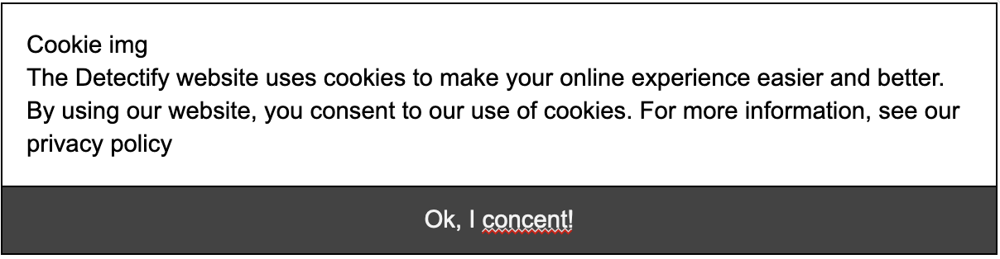

# Life Cycle Hooks

Övning är tvådelad där första fokuserar på beforeMount medan andra fokuserar på vad som händer om beforeMounted kräver särskild hantering.

## DEL 1: Övning GDPR compliance
Tekniker: localstorage.set/get, beforeMount(), vi-if / v-show

Gör en komponent ( <gdpr /> ) som bara visas första ggn man laddar sidan. Spara compliance i localStorage. Om localstorage.getItem(‘gdpr’) existerar ska inte GDPR visas.

*Hint*: Samtycke = localstorage.setItem(‘gdpr’, ‘true’)

## Utmaning 1: You shall not pass
Tekniker: router, vi-if-else, beforeMounted(), sessionStorage

1. Gör en view ( <outside /> med en login comp som sparar en session ( auth ).
2. Gör en till komponent ( <inside /> ) som visar en dold text. Den dolda text ska döljas med v-if och visas endast om ett data värde authError är true.
4. När användaren loggar in och skriver "fel" lössenord så visas ett error meddelande i <inside />, annars så visas det dolda meddelandet.
  1. Kolla om användaren är authentiserad i mounted metoden.

## Utamning 2: You shan't pass
Tekniker: vue-router, beforeMounted(), sessionStorage

Gör övning två, men gör så att outside och inside är två olika undersidor till webbsidan.
Se [named routes](https://router.vuejs.org/guide/essentials/named-routes.html) för tips på hur du kan omdirigera med vue till specifika undersidor.

Lösningsförslag med vue 2.
https://repl.it/@JohanKivi/You-shall-not-pass

Tips och övrigt material, se https://router.vuejs.org/guide/essentials/navigation.html

